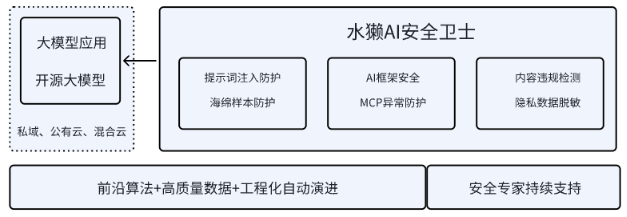

# 产品介绍

**水獭AI安全卫士简介**

**水獭AI安全卫士**是一款**专门针对AI安全的大模型围栏产品**，凭借 AI 原生安全技术，实现行业领先的威胁检测准确率，在高效拦截攻击的同时，确保 AI 模型及应用性能不受影响，兼顾安全与效率。

水獭AI安全卫士致力于解决大模型技术及大模型应用场景的安全风险，如提示词注入、框架安全、内容安全及隐私防护等。

<figure><figcaption></figcaption></figure>

<figure><figcaption></figcaption></figure>

**产品核心优势**

水獭AI安全卫士具备如下核心优势：

A.**提示词注入安全防护**：针对技术类生成的提示词越狱样本，提供100毫秒内的高效识别并标记

B.**海绵样本安全防护**：针对输入侧的海绵样本，提供100毫秒内的高效识别并标记

C. **框架安全防护**：专门针对如Ollama、Torchserve、Ray等AI框架的中高危安全风险进行防护，可根据需要提供环境检测工具；

D. **隐私脱敏防护**：支持用户输入或大模型输出敏感信息的脱敏处理；

E. **MCP安全防护**：支持大模型应用调用远程MCP工具的安全防护；

F. **内容违规防护**：支持用户输入或大模型输出内容中的涉黄、涉爆等10余种违规内容的快速检测

<figure><figcaption></figcaption></figure>

### **产品特点**

通过水獭AI安全卫士，你将获得：

A.**一站式防护应用**

&#x20;     产品支持通过防护应用功能，一站式配置目标对象代理及安全策略，操作方便简单

B.**高效威胁检测**

&#x20;      产品具备AI框架安全、提示词注入、海绵样本防护、隐私脱敏防护、MCP安全防护及内容违规防护能力，即使在串行部署下，也能够实现100毫秒内快速、精准识别告警并完成标记

C. **轻量灵活、部署方便**

&#x20;      产品轻量，最大程度满足用户无感接入，支持单节点、集群等部署方式。

<figure><figcaption></figcaption></figure>

<figure><figcaption></figcaption></figure>

<figure><figcaption></figcaption></figure>

### **产品泛化能力**

水獭AI安全卫士由北京模湖智能科技有限公司用心打造，基于团队深厚的AI安全沉淀，产品具备优秀的泛化能力。

A. 模型安全方面团队核心成员具有多年的AI安全研究经历，掌握前沿算法及不断增长的高质量数据，能够基于工程化自动平台，实现产品在模型提示词检测及相关能力方面的不断升级。

B.AI供应链方面团队核心成员会实时关注AI框架的安全情况，提供专家级的漏洞挖掘及解决方案，确保产品在AI框架及MCP方面的安全防护\

<figure><figcaption></figcaption></figure>

### **目标模型**

水獭AI安全卫士主要针对主流开源模型，如Deepseek、通义千问、文心一言等

\
\
\

### **产品形态**

水獭AI安全卫士支持软硬一体机、企业级Saas、功能模块化接入等形态

<figure><figcaption></figcaption></figure>

<figure><figcaption></figcaption></figure>

<figure><figcaption></figcaption></figure>

<figure><figcaption></figcaption></figure>

**部署方式**

部署场景支持：

A. 透明代理部署

B. 反向代码部署

C. 旁路监听部署

D. 云原生部署
